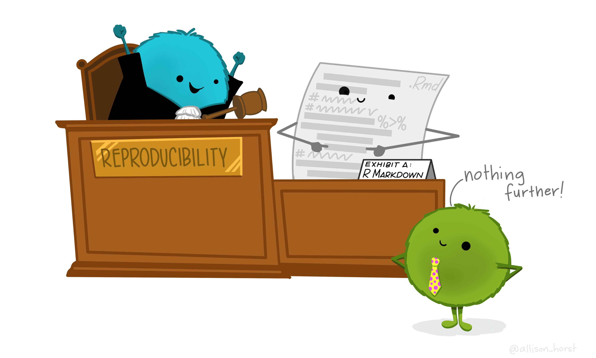

```{r, include=FALSE}
knitr::opts_chunk$set(echo = TRUE, message = FALSE, warning=FALSE, eval=FALSE,
                        dev.args=list(bg="transparent"))
```


```{r, include=FALSE}
fileConn <- file("myheader.html")
writeLines('<link rel="shortcut icon" href="http://d1ujqdpfgkvqfi.cloudfront.net/favicon-generator/htdocs/favicons/2013-10-15/19fefe8ca2a66ba90e35d0d5fc7162a6.ico">', fileConn)
close(fileConn)
```




This is a document outlining my favourite markdownd set-ups and common implementations. 


# Quick-start

Some chunk parameters to bear in mind:

| Parameter     | Values                                         | Purpose      |
|---------------|----------------------------------------------|-----------------------------------------------------------|
| eval     | TRUE                                         | Whether to evaluate the code and include its results      |
| echo     | TRUE                                         | Whether to display code along with its results            |
| warning  | TRUE                                         | Whether to display warnings                               |
| error   | FALSE                                        | Whether to display errors                                 |
| message  | TRUE                                         | Whether to display messages                               |
| tidy    | FALSE                                        | Whether to reformat code in a tidy way when displaying it |
| results       | "markup" "markup", "asis", "hold", or "hide" | How to ouput the results                                  |
| cache   | FALSE                                        | Whether to cache results for future renders               |
| comment | "##"                                         | Comment character to preface results with                 |
| fig.width   | 7                                            | Width in inches for plots created in chunk                |
| fig.height  | 7                                            | Height in inches for plots created in chunk               |


# Set up the Document

The document is set up using the YAML (a recursive acronym for "YAML Ain't Markup Language"): 
a human-readable data-serialization language which goes right at the start. It is used for 
configuring the file so useful for TOC, titles, authorship and dates.

## 🗓 Using Today's Date

date: 

```{r, eval=FALSE}
"`r format(Sys.time(), '%d %B, %Y')`"
```

To use this by default in the document add this line to the YAML:

```{r, eval=FALSE}
---
title: "Markdown cheatsheet"
date: "`r Sys.Date()`"
---
```

## 📖 Including a contents page

In the YAML include

```{r, eval=FALSE}
---
title: "Markdown cheatsheet"
 html_document: 
  toc: yes 
```

### Floating TOC at LHS

```{r, eval=FALSE}
---
title: "Markdown cheatsheet"
output:
  html_document: 
    toc: true
    toc_float: true
---
```

### Collapsible TOC

```{r, eval=FALSE}
---
title: "Markdown cheatsheet"
output:
  html_document: 
    toc: true
    toc_float:
      collapsed: false
---
```


### Including a TOC sidebar

As is used here on the left hand side

In the YAML:
```{r}
---
output:
 html_document: 
  css: cheatsheet.css
  toc: yes
---
```

Call on the css styling saves to cheatsheet.css. 

````markdown
```{css}
#TOC {
   position: fixed;
   left: 0;
   top: 0;
   width: 250px;
   background-color: #B7E1F1;
   height: 100%;
   overflow:auto;
 }
 body {
   max-width: 800px;
   margin: auto;
   margin-left:260px;
   line-height: 20px;
 }
```
````

Or you can include it at the start of your rmd file within <style>....</style>

## 💜 Add a favicon

Add an image to the header of the document. To change the icon (from heart) change to url to point to another icon: 

```{r, eval=FALSE}
fileConn <- file("myheader.html")
writeLines('<link rel="shortcut icon" href="http://d1ujqdpfgkvqfi.cloudfront.net/favicon-generator/htdocs/favicons/2013-10-15/19fefe8ca2a66ba90e35d0d5fc7162a6.ico">', fileConn)
close(fileConn)
```


# 🖥 Code-Folding

Code-folding is really useful to allow readers to inspect code if the wish without cluttering up the document. For example

<style>
div.hidecode + pre {display: none}
</style>
<script>
doclick=function(e){
e.nextSibling.nextSibling.style.display="block";
}
</script>

<buttdiv class="hidecode" onclick="doclick(this);">[Show Code]</div>
r, eval=TRUE}
summary(cars)
```


```
---
output:
 html_document: 
  code_folding: hide
---
```

# Tabbing Content

```
## title {.tabset .tabset-fade}
content above tabbed region.

## tab 1 

tab content 1

## tab 2

tab content 2

##

content below tabbed region
```

Doing it in a loop (you will need to uncomment the ``` lines): 

```{r, eval=FALSE}
## Tabbed section {.tabset .tabset-fade}

#```{r datasummary, results='asis', eval=TRUE}
var.list = paste('var', 1:5)

for (i in var.list ){  #
  cat('\n')
  cat('#### ', i, '\n')
  cat('analysis for variable', i)
  cat('\n')
}
# {.toc-ignore}```
```


## Tabbed section {.tabset .tabset-fade}

```{r, results='asis', eval=TRUE}
var.list = paste("var", 1:5)

for (i in var.list ){  #
  cat('\n')
  cat("#### ", i, "\n")
  cat("analysis for variable", i)
  cat('\n')
}
```

# Highlighted section

```
<style>
div.blue { background-color:#e6f0ff; border-radius: 5px; padding: 20px;}
</style>
<div class = "blue">

Let try highlighting a phrase: ```{r eval=FALSE} paste("hello", "world", sep=" ")``` 

</div>
```


<style>
div.blue { background-color:#e6f0ff; border-radius: 5px; padding: 20px;}
</style>
<div class = "blue">

Let try highlighting a phrase: `r paste("hello", "world", sep=" ")` 

</div>

# Nicely formatted tables

scrollable tables:

```
kable(iris)  %>%
  kable_styling() %>%
  scroll_box(width = "100%", height = "200px")
```

printable/downloadable DT tables

```
DT::datatable(iris, extensions = 'Buttons',
                options=list(dom = 'Bfrtip',
                             buttons = c('excel','csv','print'),
                             rowCallback=JS(
                               'function(row,data) {
     if($(row)["0"]["_DT_RowIndex"] % 2 <1) 
            $(row).css("background","#f2f9ec")
   }')))
```

# Running total in table

For example to get a running total in the 5th column:

```
library(htmlwidgets)
library(DT)
library(htmltools)

cols.vals = rep("", (ncol(df)) )

sketch <- htmltools::withTags(table(
  tableHeader(colnames(df)), 
  tableFooter(cols.vals)
))

jsCode <- "function(row, data, start, end, display) {
  var api = this.api(), data;
  total2 = api.column(5, {page: 'current'}).data().reduce( function(a, b) { return a 
+ b}, 0);
  $( api.column(5).footer() ).html('Total: ' + total2.toFixed(2))
  }"

DT::datatable(df, container = sketch, filter="top", rownames = NULL,
              options=list( footerCallback = JS(jsCode)))
```

# Transparent backgrounds

This allows you to simply copy and paste figures to presentations etc. 

```
knitr::opts_chunk$set(dev.args=list(bg="transparent"))
```

# Unicode variables

| Character 	| Unicode 	| In R       	|
|-----------	|---------	|------------	|
| ≤         	| U+2264  	| \\U2264 	|
| ≥         	| U+2265  	| \\U2265 	|

# Render rmds when mapped

`library("rmarkdown)`<br/>`render(filename, output_dir="./")`<br/><br/>Or if you are in the directory you are running from you can just run:<br/><br/>`rmarkdown::render(list.files(pattern=".rmd", ignore.case = TRUE), output_dir=".")`<br/><br/>NB: This works if there is only one rmd file in your directory.
